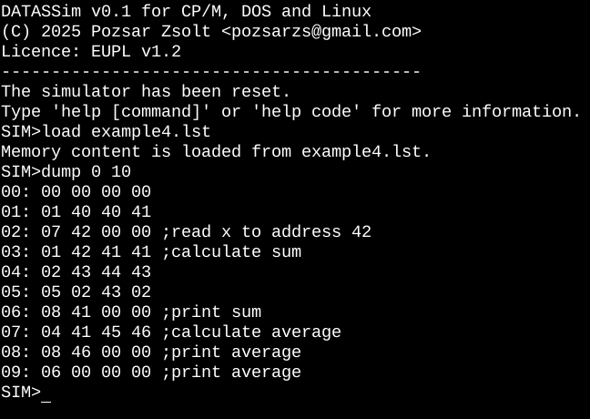

# DATASSim

**Simulator for DATAS machine language**  

### About this project

DATAS is an educational, artificial machine language designed in the 1970s to demonstrate how machine code works.

It had no real hardware, i.e. it did not belong to a real computer, but was a theoretical machine that was treated as a "machine" for educational purposes.

Its typical use was to teach Fortran or other high-level languages, so that students could understand what was going on "under the hood".

I discovered it in the Hungarian translation of the book *Algorithms and their computer solutions* [^1]. This is the only source, I couldn't find anything about it on the Internet.

> [!NOTE]
> If anyone has any information or memories about this language that they can share, I  will be happy to take them and include them in the documentation.
>

I deviated from the description in the book in that the third digit from the right of the word consisting of eight decimal numbers (the tens place value of the second, D1 group) indicates the sign, so that negative numbers can also be handled.
The memory cells can be commented on, as this is an educational model.

A special feature is that the memory cells can be commented on, as this is an educational model.

Copyright (C) 2025 Pozsár Zsolt <pozsarzs@gmail.com>  

### Features

|features                |                                                     |
|------------------------|-----------------------------------------------------|
|version                 |v0.1                                                 |
|licence                 |EUPL v1.2                                            |
|language                |en                                                   |
|user interface          |CLI                                                  |
|programming language    |Borland Turbo Pascal 3.x                             |
|architecture            |ix86, Z80                                            |
|OS                      |CP/M, DOS, Linux (see comments in the source code)   |
|internal memory         |100 word size cell (00-99)                           |
|word format             |8 decimal number (00 00 00 00 - 99 19 99 99)         |
|instructions            |10                                                   |
|example scripts         |3 scripts                                            |
|load from file          |program in text format with comments                 |
|save to file            |memory content in text format with comments          |
|export to file          |memory content to binary file                        |
|import to file          |memory content from binary file                      |
|other utility programs  |source code to binary file converter                 |

### Screenshots

Startup screen



### The commands

The program can be controlled with the following command line commands.

|   name                     |   operation                                                |
|:---------------------------|:-----------------------------------------------------------|
|`break [AA|-]`              | set, get and reset breakpoint address                      |
|`comment AA Jump\ to\ 12|-` | add or remove a sigle-line note for AA address             |
|`deposit AA D0 D1 D2 D3`    | store D0-3 value at AA address                             |
|`dump AA CN`                | print the value of memory cell number CN from AA           |
|`examine AA`                | examine value at AA address                                |
|`export filename.bin`       | export memory content to a binary file                     |
|`fill AA CN D0 D1 D2 D3`    | fill the memory cell number CN from AA with the value D0-3 |
|`help [command]`            | help with using the program                                |
|`import filename.bin`       | import memory content from a binary file                   |
|`load filename.lst`         | load source code                                           |
|`quit`                      | exit the simulator program                                 |
|`reset`                     | reset simulator                                            |
|`run [AA]`                  | run program from AA address                                |
|`save filename.lst`         | save source code                                           |
|`step`                      | run program step-by-step from AA address                   |
|`trace [on|off]`            | turn tracking on and off                                   |

### The instructions

The following instructions can be used in the machine code program.

|   name   | AA | D0 | D1 | D2 | D3 |        operation        |
|:--------:|:--:|:--:|:--:|:--:|:---|:------------------------|
|          | dd | 00 | sd | dd | dd | (AA)=D0 D1 D2           |
|`ADD`     | dd | 01 | dd | dd | dd | (D3)=(D1)+(D2)          |
|`SUBTRACT`| dd | 02 | dd | dd | dd | (D3)=(D1)-(D2)          |
|`MULTIPLY`| dd | 03 | dd | dd | dd | (D3)=(D1)*(D2)          |
|`DIVIDE`  | dd | 04 | dd | dd | dd | (D3)=(D1)/(D2)          |
|`BRANCH`  | dd | 05 | 00 | 00 | dd | jump to D3              |
|          | dd | 05 | 01 | dd | dd | if D2<0 then jump to D3 |
|          | dd | 05 | 02 | dd | dd | if D2>0 then jump to D3 |
|`HALT`    | dd | 06 | 00 | 00 | 00 | stop at AA address      |
|`READ`    | dd | 07 | dd | 00 | 00 | read a value to D1      |
|`WRITE`   | dd | 08 | dd | 00 | 00 | write a value from D1   |
|`SQRT`    | dd | 09 | dd | 00 | dd | (D3)=sqrt(D1)           |
|`ABS`     | dd | 10 | dd | 00 | dd | (D3)=|D1|               |

**Note:** 
AA:   address
D0:   operation code 
D1-3: operands 
(Dx): value at Dx address 
s:    sign of the number [0/1, +/-] 

### Source file format

```
; Calculate the square root of 23*100
01 05 00 00 52 ;jump to address 52
50 00 00 01 00 ;store 100 at address 50
```

### Hotkeys

|  key       | operation                                   |
|:----------:|:--------------------------------------------|
| `p` or `P` | suspend the execution of the loaded program |
| `s` or `S` | stop the running of the loaded program      |

[^1]: Algorithms and Their Computer Solutions by Lucio Artiaga and LLoyd D. Davis (1972 Charles E. Merill Publishing Company)
